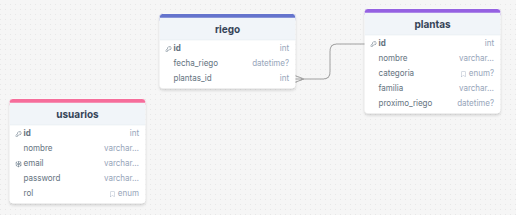
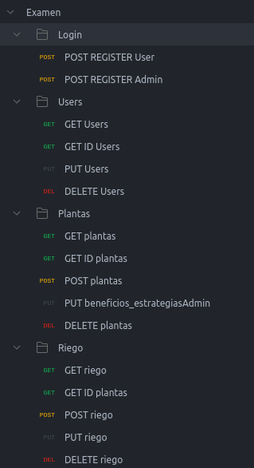

# 👨‍🚀Campers vs 🌵Plantas - Gestión de Jardín 🌻 y Registro de Riego 📈

### **Requisitos funcionales**

**Filtros dinámicos**

- Combinaciones de filtros para sugerencias inteligentes basadas en criterios.

### **Herramientas y tecnologías:**

- **Backend**: PHP 8.x, Slim Framework 4, PDO, Composer.
- **Base de datos**: MySQL.
- **Testing y API**: Postman.
- **Control de versiones**: Git y GitHub.

### **Sugerencias:**

- Empieza por diseñar la base de datos relacional con atributos categóricos bien normalizados.
- Usa Factory Pattern para crear instancias de clases DAO o controladores.
- Aplica el patrón Singleton para la conexión a la base de datos con PDO.
- Documenta bien tus endpoints en la API y prueba cada uno con Postman.

### **Imagenes:**
#### **DrawSQL:**

#### **Postman:**

